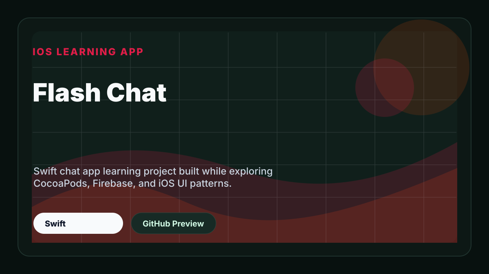

# Flash Chat

Swift chat app learning project built while exploring CocoaPods, Firebase, and iOS UI patterns.

## Preview

  

> Note: Some preview images may look slightly blurry due to screenshot compression. Thanks for your understanding.

## Project Type

iOS Learning App

## Tech Stack

- Swift

## Getting Started

Open the project in Xcode and run it on a simulator or physical device.
